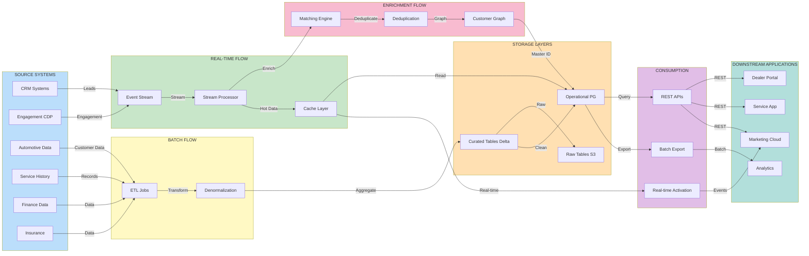
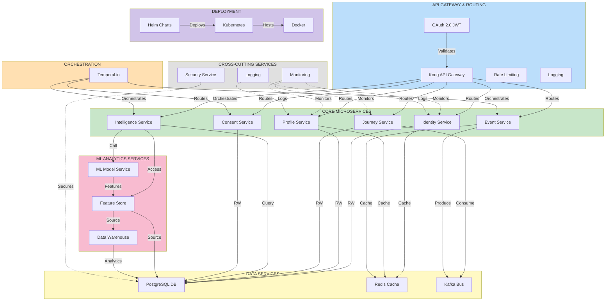
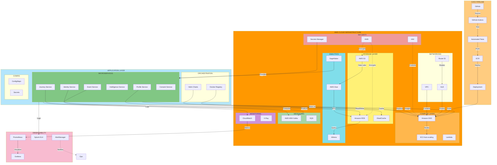
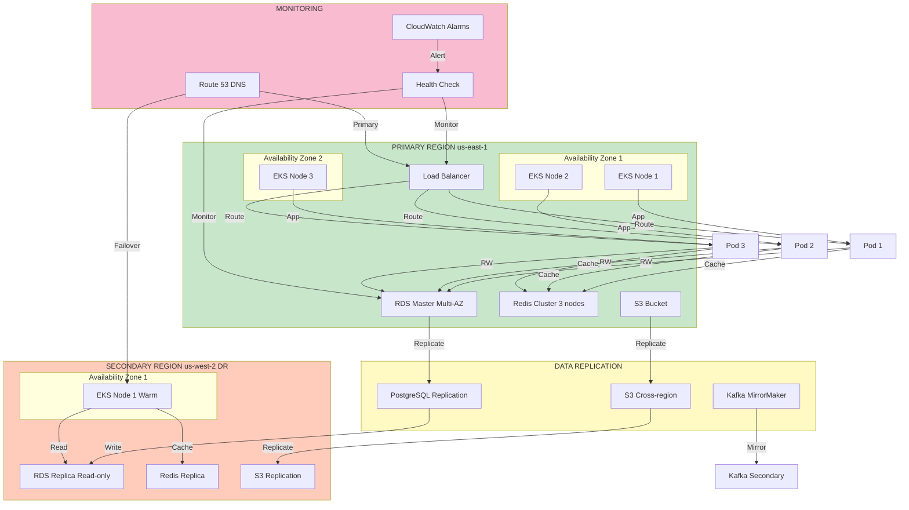
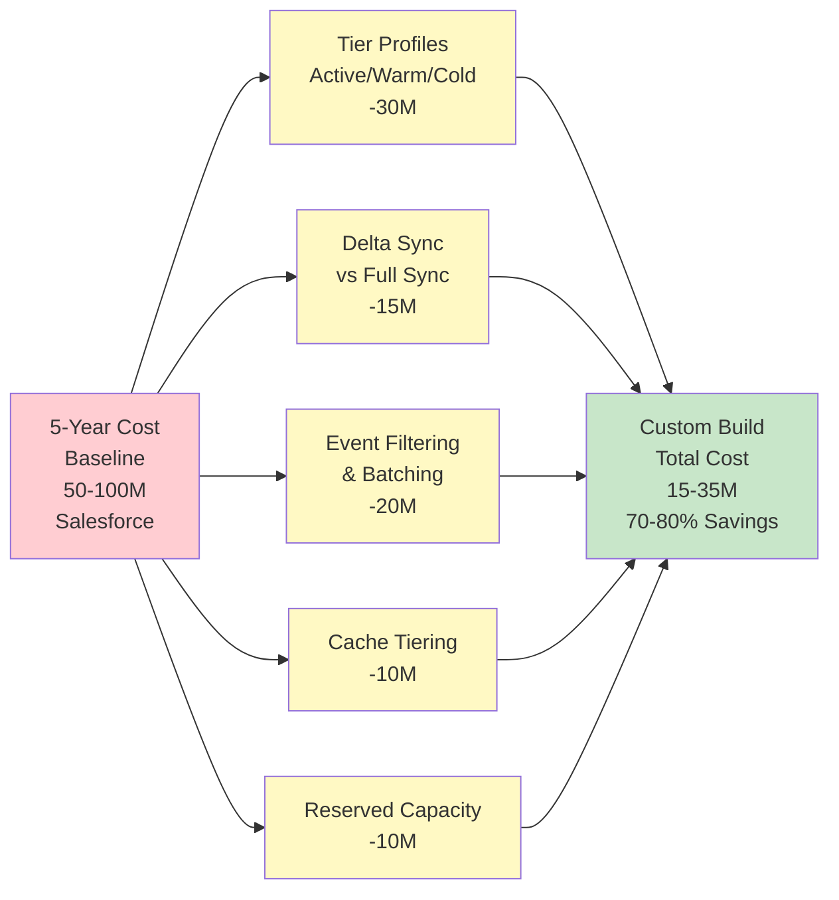

```mermaid
graph TB
    subgraph Channels["🔌 CHANNELS & TOUCHPOINTS"]
        WEB["🌐 Website"]
        MOBILE["📱 Mobile App"]
        WHATSAPP["💬 WhatsApp"]
        CALL["☎️ Call Center"]
        DEALER["🏪 Dealer/POS"]
        SERVICE["🔧 Service Center"]
        EMAIL["📧 Email/SMS"]
        SOCIAL["👥 Social Media"]
        CAMPAIGNS["📢 Campaigns"]
        VEHICLE["🚗 Connected Car"]
    end

    subgraph Sources["📊 DATA SOURCES"]
        LEADS["LeadSquared"]
        INSIDER["Insider CDP"]
        CTDMS["CTDMS"]
        TOPSERV["TOPSERV"]
        TFS["TFS Finance"]
        TIBI["TIBI Insurance"]
        OTHER["Other Systems"]
    end

    subgraph Ingestion["2A. INGESTION LAYER"]
        APIGW["API Gateway"]
        KAFKA["Kafka Events"]
        BATCH["Batch ETL"]
        MAPPING["Data Mapping"]
        QUALITY["DQ Validation"]
    end

    subgraph Identity["3.1 IDENTITY RESOLUTION"]
        MATCH["Matching Engine"]
        DEDUP["Deduplication"]
        MASTER["Master Customer ID"]
        HOUSEHOLD["Household Linking"]
    end

    subgraph Profile["3.2 UNIFIED PROFILE"]
        CUSTOMER["Customer Profile"]
        VEHICLE_D["Vehicle Data"]
        SALES["Sales History"]
        SERVICE_H["Service History"]
        FINANCE["Finance Data"]
        INSURANCE["Insurance Data"]
        CONSENT["Preferences"]
    end

    subgraph Journey["3.3 JOURNEY & TIMELINE"]
        TIMELINE["360° Timeline"]
        CHANNELS_H["Channel History"]
        TOUCHPOINTS["Touchpoint History"]
        LIFECYCLE["Lifecycle Stage"]
    end

    subgraph Intelligence["3.4 INTELLIGENCE"]
        SIGNALS["Engagement Signals"]
        RFM["RFM Scoring"]
        CHURN["Churn Risk"]
        PROPENSITY["Propensity Models"]
        HEALTH["Health Scores"]
    end

    subgraph Orchestration["3.5 ORCHESTRATION"]
        NBA["Next Best Action"]
        PERSONALIZE["Personalization"]
        OFFERS["Offer Engine"]
        WORKFLOWS["Journey Workflows"]
    end

    subgraph PlatformAPIs["3.6 API LAYER"]
        PROFILE_API["Profile API"]
        SEGMENT_API["Segment API"]
        JOURNEY_API["Journey API"]
        EVENT_API["Event API"]
        CONSENT_API["Consent API"]
    end

    subgraph Governance["3.7 GOVERNANCE"]
        METADATA["Metadata Mgmt"]
        LINEAGE["Data Lineage"]
        AUDIT["Audit Logs"]
        PRIVACY["Privacy & Consent"]
    end

    subgraph DataLayers["5. DATA FOUNDATION"]
        RAW["Raw Lake S3"]
        CURATED["Curated Store Delta"]
        OPERATIONAL["Operational Store PG+Redis"]
        REFERENCE["Reference Data"]
        DWH["Data Warehouse"]
    end

    subgraph Applications["4. CONSUMER APPS"]
        DEALER_PORTAL["Dealer Portal"]
        SERVICE_APP["Service App"]
        CALL_APP["Call Center"]
        CUSTOMER_APP["Customer Mobile"]
        ANALYTICS["Analytics Reports"]
    end

    subgraph CrossCutting["6. PLATFORM SERVICES"]
        SEC["Security"]
        MONITOR["Monitoring"]
        CICD["CI/CD"]
        HA["HA/DR"]
    end

    Channels -->|Events| Ingestion
    Sources -->|Data| Ingestion
    Ingestion -->|Cleaned| Identity
    Identity -->|Master ID| Profile
    Profile -->|Data| Journey
    Journey -->|Timeline| Intelligence
    Intelligence -->|Scores| Orchestration
    Orchestration -->|Recommendations| PlatformAPIs
    
    Ingestion -->|Raw Data| DataLayers
    Identity -->|Master Data| DataLayers
    Profile -->|Profile Data| DataLayers
    Intelligence -->|Scores| DataLayers
    
    PlatformAPIs -->|APIs| Applications
    DataLayers -->|Query| Applications
    
    Governance -.->|Oversees| Identity
    Governance -.->|Oversees| Profile
    Governance -.->|Oversees| DataLayers
    
    CrossCutting -.->|Supports| Identity
    CrossCutting -.->|Supports| PlatformAPIs
    CrossCutting -.->|Supports| DataLayers

    style Channels fill:#e3f2fd
    style Sources fill:#e3f2fd
    style Ingestion fill:#f3e5f5
    style Identity fill:#e8f5e9
    style Profile fill:#e8f5e9
    style Journey fill:#e8f5e9
    style Intelligence fill:#fff3e0
    style Orchestration fill:#fff3e0
    style PlatformAPIs fill:#fce4ec
    style Governance fill:#f1f8e9
    style DataLayers fill:#ffe0b2
    style Applications fill:#c8e6c9
    style CrossCutting fill:#e0e0e0
```

# TOYOTA C360 - MERMAID DIAGRAM SOURCE CODE & JPEG GENERATION GUIDE

## Complete Diagram Source Code with Instructions

---

## 📊 DIAGRAM 1: HIGH-LEVEL SYSTEM ARCHITECTURE

### Source Code:


---

## 📊 DIAGRAM 2: DATA FLOW ARCHITECTURE

### Source Code:


---

## 📊 DIAGRAM 3: MICROSERVICES ARCHITECTURE

### Source Code:


---

## 📊 DIAGRAM 4: DATA LAYER & STORAGE ARCHITECTURE

### Source Code:
```mermaid
graph LR
    subgraph Ingestion["INGESTION LAYER"]
        API["API Gateway REST"]
        KAFKA_IN["Kafka Topics"]
        BATCH_IN["Batch Jobs"]
    end

    subgraph ProcessingLayer["PROCESSING LAYER"]
        SPARK["Apache Spark"]
        FLINK["Apache Flink"]
    end

    subgraph RawLayer["RAW LAYER S3"]
        RAW_CUST["raw/customers"]
        RAW_EVENTS["raw/events"]
        RAW_VEHICLE["raw/vehicles"]
    end

    subgraph CuratedLayer["CURATED LAYER Delta"]
        CURATED_DIM["Dimension Tables"]
        CURATED_FACT["Fact Tables"]
        CURATED_AGG["Aggregates"]
    end

    subgraph OperationalLayer["OPERATIONAL LAYER PG+Redis"]
        PROFILE_TABLE["Profile Table"]
        TIMELINE_TABLE["Timeline Table"]
        METADATA_TABLE["Metadata"]
        REDIS_CACHE["Redis Cache"]
    end

    subgraph ReferenceLayer["REFERENCE LAYER"]
        VEHICLE_MASTER["Vehicle Master"]
        FINANCE_MASTER["Finance Products"]
        INSURANCE_MASTER["Insurance"]
        SEGMENT_DEF["Segments"]
    end

    subgraph AnalyticsLayer["ANALYTICS LAYER Snowflake"]
        MARTS["Data Marts"]
        AGGREGATES["Pre-computed"]
        DASHBOARDS["BI Dashboards"]
    end

    subgraph AccessPatterns["ACCESS PATTERNS"]
        REALTIME_API["Real-time API 100ms"]
        BATCH_EXPORT["Batch Export"]
        ANALYTICS_QUERY["Analytics Query"]
    end

    API -->|Data| ProcessingLayer
    KAFKA_IN -->|Stream| FLINK
    BATCH_IN -->|Data| SPARK

    SPARK -->|Write| RawLayer
    FLINK -->|Write| RawLayer
    SPARK -->|Transform| CuratedLayer
    FLINK -->|Enrich| CuratedLayer

    RawLayer -->|Daily| CuratedLayer
    CuratedLayer -->|Hot| OperationalLayer
    CuratedLayer -->|Warm| REDIS_CACHE
    OperationalLayer -->|Sync| ReferenceLayer

    OperationalLayer -->|Query| REALTIME_API
    OperationalLayer -->|Export| BATCH_EXPORT
    CuratedLayer -->|Load| AnalyticsLayer
    AnalyticsLayer -->|Query| ANALYTICS_QUERY

    REALTIME_API -->|API Consumers|✅
    BATCH_EXPORT -->|BI Tools|✅
    ANALYTICS_QUERY -->|Reports|✅

    style Ingestion fill:#bbdefb
    style ProcessingLayer fill:#c8e6c9
    style RawLayer fill:#fff9c4
    style CuratedLayer fill:#f8bbd0
    style OperationalLayer fill:#ffe0b2
    style ReferenceLayer fill:#e0e0e0
    style AnalyticsLayer fill:#d1c4e9
    style AccessPatterns fill:#b2dfdb
```

---

## 📊 DIAGRAM 5: DEPLOYMENT & INFRASTRUCTURE ARCHITECTURE

### Source Code:


---

## 📊 DIAGRAM 6: HA/DR TOPOLOGY

### Source Code:


---

## 📊 DIAGRAM 7: TECHNOLOGY STACK MATRIX

```
LAYER                   TECHNOLOGY              WHY
─────────────────────────────────────────────────────────
API Gateway             Kong                    API management, rate limiting, auth
Authentication          OAuth 2.0/JWT           Secure API access
Languages               Python/Java/Scala/Go    Service implementation
Data Processing Batch   Apache Spark            Large-scale ETL
Data Processing Stream  Apache Flink            Real-time event processing
Message Queue           Apache Kafka (MSK)      High-throughput event bus
RDBMS                   PostgreSQL+TimescaleDB  Customer profiles, metadata
Cache                   Redis                   Sub-100ms profile retrieval
Data Lake               AWS S3                  Long-term data retention
Curated Data            Delta Lake/Parquet      Efficient analytical queries
Data Warehouse          Snowflake/DuckDB        Business intelligence
ML Model Dev            scikit-learn/TensorFlow Predictive models
ML Model Serving        TensorFlow Serving      Real-time predictions
Orchestration           Temporal.io             Multi-step journey workflows
Container               Docker                  Application containerization
Container Orchestration Kubernetes (EKS)       Container orchestration
K8s Package Manager     Helm                    Kubernetes package management
Monitoring Metrics      Prometheus              Metrics collection
Monitoring Viz          Grafana                 Dashboard visualization
Log Aggregation         ELK/Splunk              Centralized logging
Distributed Tracing     Jaeger/DataDog          APM and tracing
CI/CD Pipeline          GitHub Actions          Automated build & deploy
Infrastructure as Code  Terraform               Infrastructure as Code
Secrets Management      AWS Secrets Manager     Credential management
Encryption              AWS KMS                 Data encryption
Identity Graph          Neo4j Optional          Entity relationships
```

---

## 📊 DIAGRAM 8: COST OPTIMIZATION SUMMARY

### Source Code:


---

# 🎨 HOW TO GENERATE JPEG FILES

## METHOD 1: ONLINE (EASIEST - 2 MINUTES)

### Step-by-Step:

**1. Visit Mermaid Live Editor:**
```
https://mermaid.live
```

**2. Copy Diagram Code:**
- Scroll to the diagram you want (above: Diagram 1-6)
- Select and copy the ENTIRE code between ```mermaid and ```
- Example: For HIGH-LEVEL-SYSTEM-ARCHITECTURE, copy everything inside the code block

**3. Paste into Editor:**
- Click in the left panel of Mermaid Live
- Clear any existing code
- Paste the diagram code
- Wait 2-3 seconds for diagram to render on the right

**4. Export as PNG/JPEG:**
- Click **Download** button (top right of diagram)
- Select format: **PNG** or **SVG**
- Choose resolution: **1920x1080** (recommended)
- Save file with name like: `01-HIGH-LEVEL-SYSTEM-ARCHITECTURE.png`

**5. Convert PNG to JPEG (if needed):**
```bash
# Using ImageMagick (if installed)
convert 01-HIGH-LEVEL-SYSTEM-ARCHITECTURE.png 01-HIGH-LEVEL-SYSTEM-ARCHITECTURE.jpg

# Or use online: https://convertio.co/png-jpg/
```

---

## METHOD 2: MERMAID CLI (RECOMMENDED FOR BATCH)

### Installation:

```bash
# Install Node.js (if not already installed)
# Then install Mermaid CLI globally
npm install -g @mermaid-js/mermaid-cli
```

### Create Diagram Files:

**1. Create file: `01-HIGH-LEVEL-SYSTEM-ARCHITECTURE.mmd`**
```
Copy and save the diagram source code (without the ```mermaid wrapper)
Example:

graph TB
    subgraph Channels...
    ...
```

**2. Repeat for all 6 diagrams:**
- 01-HIGH-LEVEL-SYSTEM-ARCHITECTURE.mmd
- 02-DATA-FLOW-ARCHITECTURE.mmd
- 03-MICROSERVICES-ARCHITECTURE.mmd
- 04-DATA-LAYER-STORAGE.mmd
- 05-DEPLOYMENT-INFRASTRUCTURE.mmd
- 06-HA-DR-TOPOLOGY.mmd
- (Diagrams 7 & 8 are reference tables, so skip those)

### Convert to PNG:

```bash
# Single diagram
mmdc -i 01-HIGH-LEVEL-SYSTEM-ARCHITECTURE.mmd \
     -o 01-HIGH-LEVEL-SYSTEM-ARCHITECTURE.png \
     --width 1920 --height 1080

# Convert to JPEG
mmdc -i 01-HIGH-LEVEL-SYSTEM-ARCHITECTURE.mmd \
     -o 01-HIGH-LEVEL-SYSTEM-ARCHITECTURE.jpg \
     --width 1920 --height 1080
```

### Batch Convert All Diagrams:

**For Mac/Linux:**
```bash
#!/bin/bash
for file in *.mmd; do
  filename="${file%.mmd}"
  mmdc -i "$file" -o "${filename}.png" --width 1920 --height 1080
  echo "Generated ${filename}.png"
done
```

**For Windows (PowerShell):**
```powershell
Get-ChildItem *.mmd | ForEach-Object {
  $name = $_.BaseName
  mmdc -i $_.FullName -o "$name.png" --width 1920 --height 1080
  Write-Host "Generated $name.png"
}
```

### Convert PNG to JPEG:

```bash
# Using ImageMagick
for file in *.png; do
  convert "$file" "${file%.png}.jpg"
  echo "Converted ${file%.png}.jpg"
done
```

---

## METHOD 3: DOCKER (NO INSTALLATION NEEDED)

```bash
# Pull Mermaid Docker image
docker pull minlag/mermaid-cli

# Convert diagram
docker run --rm -v $(pwd):/data minlag/mermaid-cli -i /data/01-HIGH-LEVEL-SYSTEM-ARCHITECTURE.mmd \
  -o /data/01-HIGH-LEVEL-SYSTEM-ARCHITECTURE.png --width 1920 --height 1080

# Batch convert all
docker run --rm -v $(pwd):/data minlag/mermaid-cli -i /data/*.mmd -o /data/ --width 1920 --height 1080
```

---

## QUICK REFERENCE: RECOMMENDED APPROACH

| Approach | Time | Skill | Best For |
|----------|------|-------|----------|
| **Mermaid Live** | 2 min/diagram | None | Quick conversion, first time |
| **Mermaid CLI** | 5 min setup | Basic Terminal | Batch conversion, automation |
| **Docker** | 10 min setup | Docker | No local installation |

**Recommendation:** Use **Mermaid Live** for first few diagrams, then use **Mermaid CLI** for batch conversion of all 6 diagrams.

---

## OUTPUT FILES

After conversion, you'll have:

```
diagrams/
├── 01-HIGH-LEVEL-SYSTEM-ARCHITECTURE.png
├── 02-DATA-FLOW-ARCHITECTURE.png
├── 03-MICROSERVICES-ARCHITECTURE.png
├── 04-DATA-LAYER-STORAGE.png
├── 05-DEPLOYMENT-INFRASTRUCTURE.png
├── 06-HA-DR-TOPOLOGY.png
├── 07-TECHNOLOGY-STACK-MATRIX.md (reference table)
└── 08-COST-OPTIMIZATION-SUMMARY.png
```

---

## TROUBLESHOOTING

### Problem: Diagram too small/large
**Solution:** Adjust `--width` and `--height` parameters
```bash
# Ultra high resolution
mmdc -i diagram.mmd -o diagram.png --width 3840 --height 2160

# Mobile size
mmdc -i diagram.mmd -o diagram.png --width 1024 --height 768
```

### Problem: Mermaid CLI won't install
**Solution:** Try alternative installation methods
```bash
# Using npm with sudo
sudo npm install -g @mermaid-js/mermaid-cli

# Using yarn
yarn global add @mermaid-js/mermaid-cli

# Using Docker (no installation needed)
docker pull minlag/mermaid-cli
```

### Problem: PNG quality is poor
**Solution:** Use higher resolution
```bash
mmdc -i diagram.mmd -o diagram.png --width 2560 --height 1600 --scale 2
```

### Problem: Converting to JPEG loses quality
**Solution:** Keep as PNG or use high-quality JPEG conversion
```bash
# High-quality JPEG
convert -quality 95 diagram.png diagram.jpg
```

---

## FILE SIZES & SPECIFICATIONS

After conversion, expect:
- **PNG files:** 500KB - 2MB (high quality)
- **JPEG files:** 200KB - 800KB (smaller, lower quality)
- **SVG files:** 50KB - 300KB (vector, scalable)

---

## NEXT STEPS

1. **Copy diagram code** from this document (one diagram at a time)
2. **Paste into Mermaid Live** (https://mermaid.live)
3. **Click Download → PNG**
4. **Save to your computer**
5. **Repeat for all 6 diagrams** (skip 7 & 8 - those are reference tables)
6. **(Optional) Convert PNG to JPEG** if needed

**Total time:** 15 minutes for all 6 diagrams using Mermaid Live

---

## FOR POWERPOINT PRESENTATIONS

**Option 1: Use PNG directly**
- Open PowerPoint
- Insert → Pictures → Select PNG file
- Resize and position as needed

**Option 2: Edit in draw.io**
1. Go to https://draw.io
2. File → Open → Select PNG
3. Edit colors, text, layout
4. Export as PNG, JPEG, PDF

---

**Last Updated:** 2026-06-05  
**All 8 Diagram Codes Ready to Use**